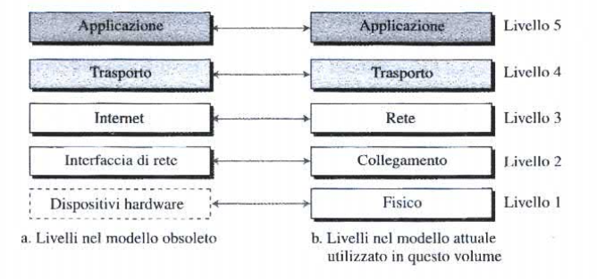

#reti 
___
# **Architettura TCP/IP**
L'<u><b>architettura TCP/IP</b></u> e' una gerarchia di [[Glossario#protocollo|protocolli]] costituita da moduli che interagiscono fra di loro, ciascuno dei quali svolge funzioni specifiche per permettere la comunicazione in una rete.
**E' un'architettura gerarchica, il che significa che ciascun protocollo di livello superiore viene supportato dai livelli inferiori**, e viene definita come **stack protocollare TCP/IP**.
Al giorno d'oggi, questa e' composta di 5 livelli.

Ciascun dispositivo e' coinvolto con determinati livelli:
- **gli host sono coinvolti in tutti e 5 i livelli**: l'host sorgente crea un messaggio a livello **applicazione** e lo trasmette ai livelli sottostanti fino al livello **fisico** affinché possa essere risalito fino al livello applicativo dell'host destinatario.
- **il router e' coinvolto solamente per tre livelli**: I livelli **rete**, **collegamento** e **fisico**. I livelli **trasporto** e **applicazione** non hanno senso di esistere perche' il router e' utilizzato solamente per scopi di instradamento.
- **uno switch e' coinvolto solo in 2 livelli**: i livelli **collegamento** e **fisico**.
## **I livelli nello stack protocollare TCP/IP**
I livelli nello stack TCP/IP sono i seguenti:
### **Livello applicazione**
Il collegamento logico tra due livelli **applicazione** e' *end-to-end*, cioè i due livelli si scambiano messaggi come se fossero direttamente collegati.
La comunicazione a questo livello avviene tra due processi. Per comunicare, un processo invia una richiesta all'altro e riceve una risposta: la comunicazione **processo-a-processo** e' il compito proprio del livello applicativo.
A questo livello sono definiti numerosi protocolli, come l'[[HTTP]], l'[[SMTP]] oppure l'[[FTP]].
### **Livello di trasporto**
Anche la connessione logica a livello di trasporto e' *end-to-end*. Il livello di **trasporto** riceve il messaggio dal livello **applicazione**, lo incapsula in un [[Glossario#segmento|segmento]] e lo invia tramite una **connessione virtuale**, al livello trasporto del destinatario. 
I protocolli a questo livello sono progettati per compiti molto specifici. Il protocollo principale e' il **TCP** (*Transmission Control Protocol*) ed e' un protocollo *connection-oriented*, ovvero stabilisce per prima cosa una connessione logica fra due livelli di trasporto prima di trasferire i dati
Il secondo protocollo più utilizzato e' l'**UDP** (*User Datagram Protocol*) ed e' un protocollo *connectionless* che trasmette **datagrammi** senza creare una connessione logica. Questo protocollo non prevede quindi controllo degli errori, del flusso o della congestione ed e' implementato soprattutto in applicazioni che non possono permettersi la ritrasmissione dei pacchetti corrotti o smarriti (al contrario di ciò che avviene nel TCP).
### **Livello di rete**
Il compito del livello di rete e' quello di far arrivare i pacchetti dall'host sorgente a quello destinazione. In questo caso la comunicazione e' *host-to-host*.
Si può affermare che il livello di rete e' responsabile della comunicazione e dell'[[instradamento]] e inoltro dei pacchetti.
Il protocollo principale a questo livello e' l'**IP** (*Internet Protocol*) che definisce il formato del **datagramma**. Fornisce anche il formato e la struttura degli indirizzi utilizzati in questo livello ed e' responsabile dell'inoltro di un pacchetto dalla sorgente al destinatario.
Sono inclusi anche protocolli ausiliari come il protocollo **DHCP** (*Dynamic Host Configuration Protocol*) che consente di ottenere l'indirizzo IP da assegnare ad un host.
### **Livello di collegamento**
