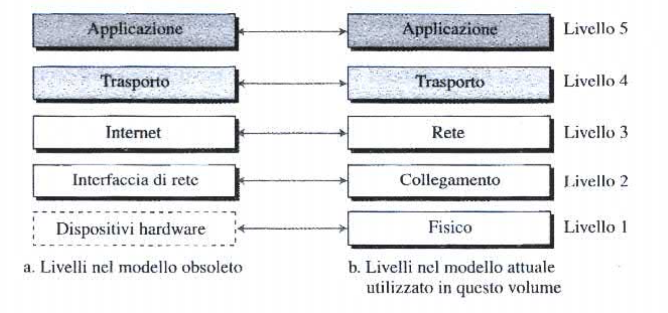

#reti 
___
# **Architettura TCP/IP**
L'<u><b>architettura TCP/IP</b></u> e' una gerarchia di [protocolli](../Glossario.md#protocollo) costituita da moduli che interagiscono fra di loro, ciascuno dei quali svolge funzioni specifiche per permettere la comunicazione in una rete.
**E' un'architettura gerarchica, il che significa che ciascun protocollo di livello superiore viene supportato dai livelli inferiori**, e viene definita come **stack protocollare TCP/IP**.
Al giorno d'oggi, questa e' composta di 5 livelli.

Ciascun dispositivo e' coinvolto con determinati livelli:
- **gli host sono coinvolti in tutti e 5 i livelli**: l'host sorgente crea un messaggio a livello **applicazione** e lo trasmette ai livelli sottostanti fino al livello **fisico** affinché possa essere risalito fino al livello applicativo dell'host destinatario.
- **il router e' coinvolto solamente per tre livelli**: I livelli **rete**, **collegamento** e **fisico**. I livelli **trasporto** e **applicazione** non hanno senso di esistere perche' il router e' utilizzato solamente per scopi di instradamento.
- **uno switch e' coinvolto solo in 2 livelli**: i livelli **collegamento** e **fisico**.
## **I livelli nello stack protocollare TCP/IP**
I livelli nello stack TCP/IP sono i seguenti:
### **Livello applicazione**
Il collegamento logico tra due livelli **applicazione** e' *end-to-end*, cioè i due livelli si scambiano messaggi come se fossero direttamente collegati.
La comunicazione a questo livello avviene tra due processi. Per comunicare, un processo invia una richiesta all'altro e riceve una risposta: la comunicazione **processo-a-processo** e' il compito proprio del livello applicativo.
A questo livello sono definiti numerosi protocolli, come l'[[HTTP]], l'[[SMTP]] oppure l'[[FTP]].
### **Livello di trasporto**
Anche la connessione logica a livello di trasporto e' *end-to-end*. Il livello di **trasporto** riceve il messaggio dal livello **applicazione**, lo incapsula in un [[Glossario#segmento|segmento]] e lo invia tramite una **connessione virtuale**, al livello trasporto del destinatario. 
I protocolli a questo livello sono progettati per compiti molto specifici. Il protocollo principale e' il **TCP** (*Transmission Control Protocol*) ed e' un protocollo *connection-oriented*, ovvero stabilisce per prima cosa una connessione logica fra due livelli di trasporto prima di trasferire i dati
Il secondo protocollo più utilizzato e' l'**UDP** (*User Datagram Protocol*) ed e' un protocollo *connectionless* che trasmette **datagrammi** senza creare una connessione logica. Questo protocollo non prevede quindi controllo degli errori, del flusso o della congestione ed e' implementato soprattutto in applicazioni che non possono permettersi la ritrasmissione dei pacchetti corrotti o smarriti (al contrario di ciò che avviene nel TCP).
### **Livello di rete**
Il compito del livello di rete e' quello di far arrivare i pacchetti dall'host sorgente a quello destinazione. In questo caso la comunicazione e' *host-to-host*.
Si può affermare che il livello di rete e' responsabile della comunicazione e dell'[[instradamento]] e inoltro dei pacchetti.
Il protocollo principale a questo livello e' l'**IP** (*Internet Protocol*) che definisce il formato del **datagramma**. Fornisce anche il formato e la struttura degli indirizzi utilizzati in questo livello ed e' responsabile dell'inoltro di un pacchetto dalla sorgente al destinatario.
Sono inclusi anche protocolli ausiliari come il protocollo **DHCP** (*Dynamic Host Configuration Protocol*) che consente di ottenere l'indirizzo IP da assegnare ad un host.
### **Livello di collegamento**
All'interno di una *internetwork* ci sono diverse LAN e WAN interconnesse, con percorsi anche parzialmente sovrapposti.
Il livello di collegamento ha il compito (tramite i router) di scegliere il percorso migliore per trasferire un pacchetto. Per ciascun percorso potrebbero poi essere usati protocolli differenti.
Non esiste alcun protocollo specifico per questo livello, ma supporta tutti i protocolli standard e proprietari. I protocolli a questo livello possono comunque offrire servizi diversi, come la rilevazione e correzione degli errori, o altri.
### **Livello fisico**
Il livello fisico si occupa di trasferire i singoli bit attraverso il collegamento. La comunicazione tra due dispositivi e' ancora una comunicazione logica, perche' vi e' un livello nascosto, ovvero il mezzo trasmissivo al di sotto del livello fisico. Due dispositivi sono collegati tramite un mezzo trasmissivo, ma non trasporta bit, bensì segnali elettrici / ottici.
Il livello fisico si occupa di **trasferire i singoli bit** di un flusso dati attraverso il mezzo trasmissivo, convertendoli in segnali elettrici, ottici o radio a seconda della tecnologia utilizzata (rame, fibra ottica, onde radio, ecc.).  
Definisce quindi **le caratteristiche meccaniche, elettriche, funzionali e procedurali** necessarie per l’attivazione, il mantenimento e la disattivazione del collegamento fisico tra dispositivi.

## **Incapsulamento e Decapsulamento**
Nel modello **TCP/IP**, i dati viaggiano attraverso tutti i livelli (*applicazione*, *trasporto*, *rete*, *collegamento*, *fisico*). Ogni livello aggiunge o rimuove informazioni necessarie per permettere permettere **la comunicazione tra** due terminali.
Il processo che **aggiunge** informazioni mentre i dati scendono lungo i livelli si chiama ***incapsulamento***: ad ogni livello, viene aggiunta un'intestazione con informazioni specifiche per quel livello. (*svolto dal mittente*)
Il processo inverso si chiama ***decapsulamento*** ed e' il processo che rimuove la propria intestazione, interpretando le informazioni e passando il loro contenuto al livello superiore. (*svolto dal destinatario*).

In particolare:
- **incapsulamento nell'host sorgente**: 
	- A livello **applicazione**, i dati da scambiare vengono chiamati messaggi e, di solito, non contengono **header**. 
	- A livello **trasporto** il messaggio viene chiamato **segmento/datagramma** (*a seconda del protocollo utilizzato*) e vengono aggiunte informazioni per la sua gestione a quel livello. 
	- Il livello **rete** aggiunge altre informazioni, quali gli indirizzi della sorgente e destinatario e informazioni utilizzate per il controllo degli errori, frammentazione, ecc. Qui viene chiamato **datagramma**. 
	- A livello di **collegamento** il pacchetto e' chiamato **frame** e vengono aggiunte informazioni quali indirizzo del livello di collegamento e del **next-hop** (*router*).
	
- **incapsulamento e decapsulamento nel router**: Nel router si effettua sia l'incapsulamento che il decapsulamento perche' questi e' collegato a due o piu' link:
	- L'insieme di bit ricevuto dal livello **fisico** viene passato a livello di collegamento dopo aver decapsulato il **frame**.
	- Il livello di **rete** consulta solamente gli indirizzi sorgente e destinatario nell'**header** del datagramma e consulta la propria tabella per decidere il **next-hop**. Il datagramma non viene alterato, a meno che non ci sia bisogno di frammentarlo per via di dimensioni eccessive.
	- Il livello di **collegamento** incapsula il datagramma in un frame e lo passa al livello fisico per la trasmissione.

- **decapsulamento nell'host destinatario**: Ciascun livello nell'host destinatario rimuove la propria intestazione dal pacchetto ricevuto, estraendone il **payload**; questo viene passato al protocollo del livello sovrastante, fino a quando il messaggio raggiunge il livello **applicazione**. 

***NB: Il decapsulamento di per sé non implica la correzione degli errori, ma solo l’estrazione dei dati. Il controllo degli errori, se previsto, viene effettuato dal livello di trasporto o di collegamento, a seconda del protocollo.***

## **Indirizzamento**
